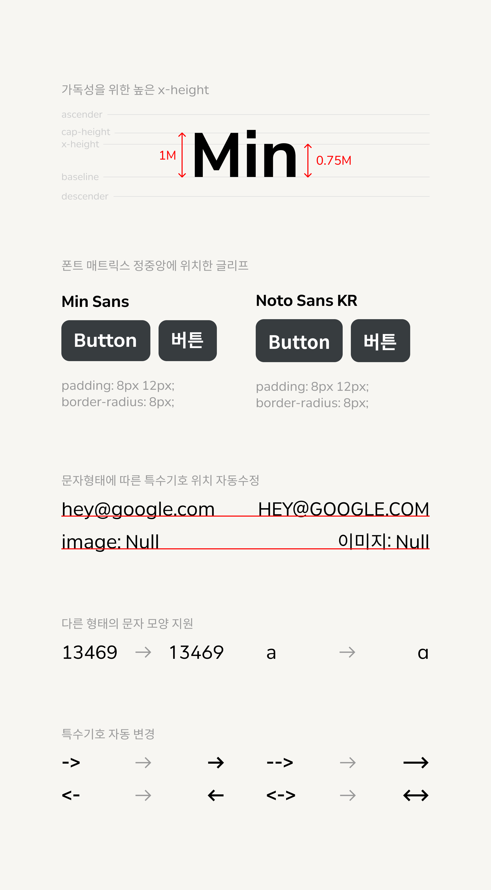

# MinSans

- 🔗[Min Sans 다운로드](https://github.com/poposnail61/min-sans/releases/download/v1.4.2/fonts.zip)
- ✏️[Min Sans 써보기](https://poposnail61.github.io/write/)

## Overview

**Min Sans**는 한·중·일 문자와 라틴 문자, 숫자를 조화롭게 만든 다국어 글꼴입니다. *Noto Sans*와 *Nunito Sans*를 기반으로 커스텀되었으며, 크로스 플랫폼에서 동일한 결과물을 내도록 디자인되었습니다.

- 4배수, 8배수 디자인에 적합하도록 디자인
    - 주요 폰트 사이즈에 대해 짝수의 행간을 제공합니다.
    - web 기준이며 프로그램에 따라 다르게 표현될 수 있습니다.

|font-size | 9 | 11 | 12 | 14 | 15 | 17 | 18 | 20 | 24 | 36 | 48 | 72 | 96 |
|--- | --- | --- | --- | --- | --- | --- | --- | --- | --- | --- | --- | --- | ---|
|line-height | 12 | 14 | 16 | 18 | 20 | 22 | 24 | 26 | 32 | 48 | 64 | 96 | 128 |

- 사용성이 높은 9개의 폰트패밀리로 구성
- CJK문자 및 라틴계열 문자 세트 지원

## 웹폰트

다이나믹 서브셋을 지원하여 적은 용량으로 Min Sans의 사용이 가능합니다.

### Min Sans
#### HTML

```html
<link rel="stylesheet" href="https://cdn.jsdelivr.net/gh/poposnail61/min-sans@main/web/css/minsans-dynamic-subset.css"/>
```

#### CSS

```css
@import url("https://cdn.jsdelivr.net/gh/poposnail61/min-sans@main/web/css/minsans-dynamic-subset.css");
```
    
### Min Sans VF
#### HTML

```html
<link rel="stylesheet" href="https://cdn.jsdelivr.net/gh/poposnail61/min-sans@main/web/css/minsansvf-dynamic-subset.css"/>
```

#### CSS

```css
@import url("https://cdn.jsdelivr.net/gh/poposnail61/min-sans@main/web/css/minsansvf-dynamic-subset.css");
```





### 라이선스

[SIL 오픈 폰트 라이선스](https://scripts.sil.org/cms/scripts/page.php?site_id=nrsi&id=OFL)

### 지원 포맷

`.ttf`, `.otf`, `.woff2`

### Contact

폰트에 대한 제안은 poposnail61@gmail.com 또는 [깃허브 이슈](https://github.com/poposnail61/MinSans/issues)로 등록해주세요.